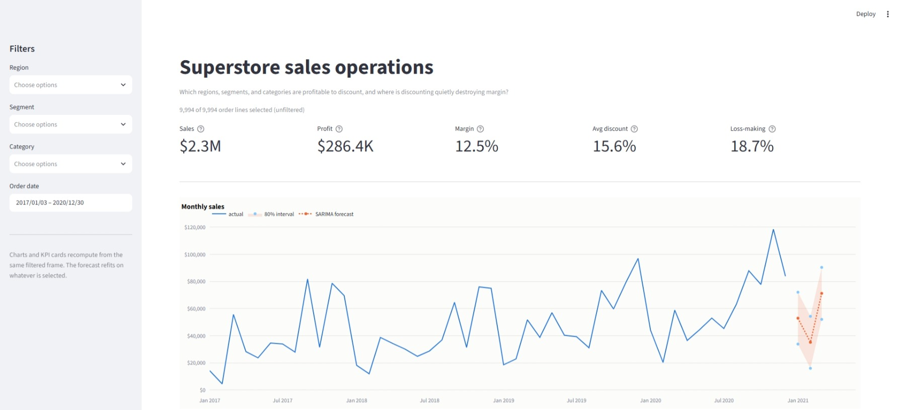
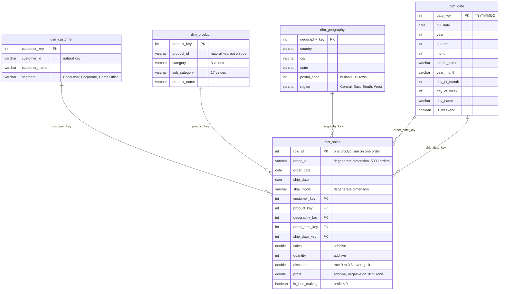

# US Superstore Sales & Sales Operations Analytics

[](https://github.com/nicksopcic/Project-2-superstore-sales-analytics/actions/workflows/ci.yml)

A sales-operations analytics layer over four years of US retail order lines: a DuckDB star
schema, a 22-query SQL suite, statistical analysis of discounting, a backtested sales forecast,
and a Streamlit dashboard. Built the way a sales-ops team would need it, with every number
reproducible from the raw file by four commands.

**The business question:** Which regions, segments, and product categories are profitable to
discount, and where is discounting quietly destroying margin?

**The answer:** discounting past 20% destroys margin, it explains three quarters of the
variation in margin across the business, and five sub-categories are routinely sold past the
point where they stop paying for themselves.

## Key findings

**1. Margin survives a 20% discount and collapses immediately above it.** Lines discounted 11
to 20% return an 11.58% margin. The very next band, 21 to 30%, returns **-10.05%**, and 91.6%
of those lines lose money. Past 40%, every single line loses money, turning $128,632 of revenue
into a $99,559 loss. There is no gentle decline between the two, which is what makes a cap
workable as a policy.

**2. Discount explains 75.1% of the variance in margin.** An OLS regression of margin on
discount, quantity, and category dummies gives a discount coefficient of **-195.2** with HC3
robust standard errors: every 10 points of discount costs **19.5 points of margin**, holding
quantity and category constant. Since the average full-price line earns 34 points of margin,
roughly 17 points of discount erases all of it. ANOVA (F = 5,590.1) and Kruskal-Wallis
(H = 4,672.2) both confirm the tier differences at p below any conventional threshold.

**3. Five sub-categories are sold past their own break-even discount.** Fitting margin against
discount within each sub-category and solving for zero gives the ceiling each line's own
history implies:

| Sub-category | Breaks even at | Actually sold at | Past the ceiling by | Margin |
| --- | ---: | ---: | ---: | ---: |
| Tables | 16.4% | 26.1% | 9.7 points | -8.56% |
| Binders | 28.8% | 37.2% | 8.4 points | 14.86% |
| Bookcases | 15.4% | 21.1% | 5.7 points | -3.02% |
| Appliances | 12.2% | 16.7% | 4.5 points | 16.87% |
| Machines | 27.0% | 30.6% | 3.6 points | 1.79% |

**4. 19.2% of customers generate 80% of profit, and the bottom fifth give a quarter of it
back.** Cumulative profit share peaks at **124.9%** at the 638th of 793 customers, then falls
to 100%, because 155 customers lose **$71,224** between them. Those customers are not a
different kind of buyer: their average discount is **23.8% against 15.6% overall**, putting
them on the wrong side of the same cliff. The pricing problem and the customer problem are one
problem.

**5. Next quarter forecasts at $159,264, up 29% year over year, with an 18.0% typical error.**
SARIMA beat Prophet (18.6% MAPE) and a seasonal-naive baseline (25.4%) on a six-month holdout.
The 80% interval runs $101,846 to $216,682, which is the honest width for a series with only 48
monthly observations.

## Recommendations

**Cap discounts at the break-even rate for the five sub-categories above.** This is the single
highest-value change available. Lines already sold past their cap in those five carry
**$121,494 of losses**, equal to 42% of total company profit. Start with Tables: 247 lines
above a 16.4% cap, losing $31,002.

One caveat stated plainly, because it decides how the number should be used: that $121,494 is
an upper bound that assumes volume holds at the lower discount. Some of it would not convert.
Treat it as the size of the prize, not a committed recovery, and pilot the cap on one
sub-category before rolling it out.

**Require approval above 20% rather than banning it.** The cliff is sharp enough that a 20%
threshold is a defensible default across the business, and 4,798 lines already sell at full
price with a 29.51% margin. Deep discounts should be a deliberate exception with a named
approver, not a routine lever.

**Give the Central region attention first.** It runs a 7.9% margin with 31.9% of its lines
losing money, against 14.9% and 9.9% in the West. Its margin fell from 13.5% in 2019 to 5.1% in
2020 while sales stayed flat, so the trend is going the wrong way.

**Name owners for the top 20 accounts.** They deliver 26.0% of all profit from 2.5% of
customers. Concentration that high is a risk as much as an asset.

**Leave Paper, Labels, and Envelopes alone as promotional levers.** They break even only past a
70% discount and are never discounted beyond 20%, so they have genuine headroom if promotion is
needed.

## Dashboard

```bash
.venv\Scripts\python.exe -m streamlit run app/streamlit_app.py
```

Then open http://localhost:8501. Calling the virtualenv's Python directly avoids depending on
the environment being activated first, which is the usual reason this command fails on Windows.
See [Troubleshooting](#troubleshooting).

Sidebar filters for region, segment, category, and date range. Five KPI cards, a monthly trend
with the SARIMA forecast and its 80% interval overlaid, a discount-against-margin scatter, and
a sub-category profit ranking. Every element recomputes from the same filtered frame, and the
forecast refits on whatever is selected.



Below the fold, not shown above: the discount-against-margin scatter and the sub-category
profit ranking, side by side, plus an expander with the underlying table.

## How to run

```bash
python -m venv .venv
.venv\Scripts\python.exe -m pip install -r requirements.txt
```

Then build everything from the raw CSV:

```bash
.venv\Scripts\python.exe -m src.ingest
```

```bash
.venv\Scripts\python.exe -m src.transform_star_schema
```

```bash
.venv\Scripts\python.exe -m src.data_quality
```

```bash
.venv\Scripts\python.exe -m src.run_sql_report
```

That is: raw CSV into DuckDB as `stg_orders`, then the four dimensions and `fact_sales`, then
validation plus the Parquet export, then both SQL suites. Every step is idempotent, so
rerunning rebuilds from the CSV.

Optional analysis steps:

```bash
.venv\Scripts\python.exe -m src.profitability   # regression, tier tests, break-even discounts
```

```bash
.venv\Scripts\python.exe -m src.forecasting     # backtest and next-quarter forecast
```

```bash
.venv\Scripts\python.exe -m pytest -q
```

```bash
.venv\Scripts\python.exe -m ruff check .
```

```bash
.venv\Scripts\python.exe -m src.export_bi   # star schema as CSVs for Power BI
```

Every command calls the virtualenv's Python explicitly rather than assuming an activated
environment. On macOS and Linux the equivalent is `.venv/bin/python`. If you prefer to activate
first, see [Troubleshooting](#troubleshooting) for the Windows caveat.

## Troubleshooting

**`streamlit : The term 'streamlit' is not recognized`** or the same for `python -m src...`
failing on imports. The virtualenv is not active, so the commands are running against a
different Python. Either use the explicit `.venv\Scripts\python.exe -m ...` form above, which
always works, or activate the environment first.

**`Activate.ps1 cannot be loaded because running scripts is disabled on this system`.** This is
the usual reason activation silently does not happen on a fresh Windows install: PowerShell
ships with the execution policy set to `Restricted`, which blocks the activation script. Three
options, in order of preference:

1. Skip activation and use `.venv\Scripts\python.exe -m ...` everywhere, as above.
2. Switch to Command Prompt and use the batch activator, which the policy does not block.
   Note this only works in `cmd.exe`: running it from PowerShell appears to succeed but sets
   nothing, because the batch file's environment changes die with the subprocess.
   ```bash
   .venv\Scripts\activate.bat
   ```
3. Permit local scripts for your user account. This changes a Windows security setting, so read
   what it does before running it:
   ```bash
   Set-ExecutionPolicy -Scope CurrentUser RemoteSigned
   ```

**`Port 8501 is already in use`.** An earlier Streamlit is still running. Either point the new
one somewhere else with `--server.port 8502`, or find and stop the old process:

```bash
Get-NetTCPConnection -State Listen -LocalPort 8501 | Select-Object OwningProcess
```

**`FileNotFoundError: Missing Parquet for fact_sales`.** The dashboard and the notebooks read
`data/processed/`, which is gitignored and therefore absent on a fresh clone. Run the four build
commands above first.

## Data model

The flat source file is modelled as a star schema in DuckDB. `fact_sales` holds one row per
order line at the grain of the source `Row ID`, and joins to four conformed dimensions.



| Table | Rows | Primary key |
| --- | ---: | --- |
| `fact_sales` | 9,994 | `row_id` |
| `dim_customer` | 793 | `customer_key` |
| `dim_product` | 1,894 | `product_key` |
| `dim_geography` | 632 | `geography_key` |
| `dim_date` | 1,464 | `date_key` |

Every dimension uses an integer surrogate key, because none of the natural keys is unique
enough to serve as a primary key. 32 Product IDs are reused across two different product names,
postal code 92024 covers both San Diego and Encinitas, and 11 rows have no postal code at all.
[`sql/01_schema.sql`](sql/01_schema.sql) documents each key and the reasoning.

`dim_date` is a contiguous daily calendar from the first order date to the last ship date, 1,464
days, rather than only the 1,236 dates on which orders were placed. The gapless spine keeps
running YTD and month-over-month queries honest about quiet periods, and lets both
`order_date_key` and `ship_date_key` resolve against the same dimension.

## Analysis

| Notebook | Contents |
| --- | --- |
| [01_eda.ipynb](notebooks/01_eda.ipynb) | Distributions, category and sub-category rollups, correlation matrix |
| [02_discount_profit_analysis.ipynb](notebooks/02_discount_profit_analysis.ipynb) | Scatter with fitted line, OLS, ANOVA and Kruskal-Wallis, break-even by sub-category |
| [03_customer_pareto_clv.ipynb](notebooks/03_customer_pareto_clv.ipynb) | Pareto curve, top 20 accounts, loss-making customers, segment comparison |
| [04_forecasting.ipynb](notebooks/04_forecasting.ipynb) | Backtest of three models, next-quarter forecast overall and by region |

| SQL suite | Queries | Results |
| --- | ---: | --- |
| [02_fundamental_queries.sql](sql/02_fundamental_queries.sql) | 13 | [report](reports/sql_fundamental_results.md) |
| [03_advanced_queries.sql](sql/03_advanced_queries.sql) | 9 | [report](reports/sql_advanced_results.md) |

The advanced suite is the window-function and CTE work: running YTD per region that resets each
January, `RANK()` within region, month-over-month and year-over-year growth with `LAG()`, and
the customer lifetime CTE that feeds the Pareto analysis.

Generated reports: [data quality](reports/data_quality_report.md),
[discount and profit](reports/discount_profit_analysis.md),
[forecast](reports/forecast_results.md).

## Data quality

`python -m src.data_quality` runs seven checks against the star schema and writes
[reports/data_quality_report.md](reports/data_quality_report.md). The same checks run as tests,
so a regression in the source data fails the build rather than quietly reaching the analysis.

Six pass outright: Row ID is unique, no line ships before it is ordered, all five foreign keys
resolve with no nulls, measures stay in range, attributes are complete apart from a known gap,
and the repeated order/product pairs are split lines rather than errors.

Two findings need a human decision rather than a code fix, and are documented rather than
silently corrected:

- **11 rows have no postal code**, all in Burlington, Vermont. Preserved as null rather than
  imputed, so any geography rollup keyed on postal code excludes them.
- **Rows 3406 and 3407 are byte-identical** on order `US-2017-150119`. This is the one true
  duplicate in the file, as against seven legitimate split lines. Left in place, since dropping
  a source row is an analytical decision rather than a transform decision.

## Dataset

`data/raw/Sample_Superstore.csv` holds 9,994 US retail order-line records covering customer,
product, geography, sales, quantity, discount, and profit fields. Orders span 2017-01-03 to
2020-12-30, and ship dates run through 2021-01-05.

| Field group | Columns |
| --- | --- |
| Order | Row ID, Order ID, Order Date, Ship Date, Ship Mode |
| Customer | Customer ID, Customer Name, Segment |
| Geography | Country, City, State, Postal Code, Region |
| Product | Product ID, Category, Sub-Category, Product Name |
| Measures | Sales, Quantity, Discount, Profit |

This is the widely distributed Tableau/community "Sample - Superstore" dataset, used here for
demonstration and portfolio purposes. It is not proprietary company data, and no finding in this
repository describes a real business.

### Provenance

Extracted from the `Orders` sheet of the Tableau Desktop 2020.4 sample workbook
(`Sample - Superstore.xls`) with `pandas.read_excel`. Two normalizations were applied and nothing
else. Measures, dates, and text round-trip exactly against the source.

- `Country/Region` renamed to `Country`, matching the `dim_geography` column naming.
- `Postal Code` written as an integer rather than the float pandas infers from the 11 blank
  values (all Burlington, Vermont). Those 11 blanks are preserved as empty, not imputed.

The workbook's `People` (4 rows) and `Returns` (800 rows) sheets were not exported, since no
phase of the analysis uses them.

This 2020.4 edition dates orders 2017-2020, while the older and more commonly cited version of
Superstore covers 2014-2017. Any comparison against published figures from that version will
differ on absolute dates, though the row count and measures are the same.

## Tech stack

| Layer | Tools |
| --- | --- |
| Storage and query | DuckDB, Parquet, SQL (window functions, CTEs) |
| Transform | Python, pandas, a dimensional star schema |
| Statistics | statsmodels (OLS with HC3 robust errors), scipy (ANOVA, Kruskal-Wallis, Levene) |
| Forecasting | SARIMA (statsmodels), Prophet, seasonal-naive baseline, MAPE and RMSE backtesting |
| Visualization | Matplotlib for the notebooks, Plotly for the dashboard, a colour-vision-validated palette |
| Application | Streamlit |
| Quality | pytest (105 tests), ruff, GitHub Actions |

## External BI

The Power BI report is built by hand on top of the same star schema. Export the tables first:

```bash
.venv\Scripts\python.exe -m src.export_bi
```

That writes one CSV per table to `reports/bi_exports/`, plus a
[setup guide](reports/bi_exports/README.md) covering the import settings, the relationships to
build, and the DAX measures to paste. The CSVs are gitignored, since they are derived from the
committed raw file and rebuilt by rerunning the command.

> Published report placeholder: publish to the Power BI Service and link it here.

## Repository layout

| Path | Contents |
| --- | --- |
| `data/raw/` | Source CSV (committed) |
| `data/processed/` | Star-schema Parquet outputs (gitignored) |
| `db/` | Local DuckDB database (gitignored) |
| `sql/` | Schema documentation, fundamental queries, advanced queries, views |
| `src/` | Ingest, transform, data quality, SQL runner, profitability, forecasting, plotting, BI export |
| `notebooks/` | EDA, discount and profit, Pareto and CLV, forecasting |
| `app/` | Streamlit dashboard |
| `tests/` | Pipeline, data-quality, SQL, and analysis tests |
| `reports/` | Generated reports and figures |
