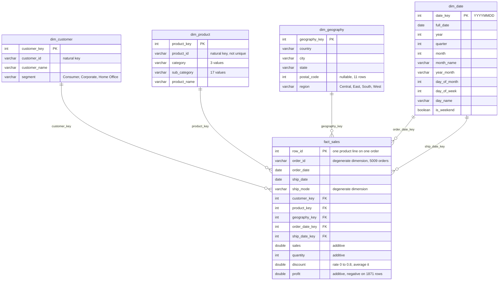

# US Superstore Sales & Sales Operations Analytics

Sales-operations analytics on the Sample Superstore dataset: a DuckDB star schema, a SQL
analysis suite, Python modules for profitability and forecasting, and a Streamlit dashboard.

**Guiding business question:** Which regions, segments, and product categories are profitable
to discount, and where is discounting quietly destroying margin?

## Dataset

`data/raw/Sample_Superstore.csv` holds 9,994 US retail order-line records covering customer,
product, geography, sales, quantity, discount, and profit fields. Orders span 2017-01-03 to
2020-12-30, and ship dates run through 2021-01-05.

| Field group | Columns |
| --- | --- |
| Order | Row ID, Order ID, Order Date, Ship Date, Ship Mode |
| Customer | Customer ID, Customer Name, Segment |
| Geography | Country, City, State, Postal Code, Region |
| Product | Product ID, Category, Sub-Category, Product Name |
| Measures | Sales, Quantity, Discount, Profit |

This is the widely distributed Tableau/community "Sample - Superstore" dataset, used here for
demonstration and portfolio purposes. It is not proprietary company data, and no finding in this
repository describes a real business.

### Provenance

Extracted from the `Orders` sheet of the Tableau Desktop 2020.4 sample workbook
(`Sample - Superstore.xls`) with `pandas.read_excel`. Two normalizations were applied and nothing
else. Measures, dates, and text round-trip exactly against the source.

- `Country/Region` renamed to `Country`, matching the `dim_geography` column naming.
- `Postal Code` written as an integer rather than the float pandas infers from the 11 blank values
  (all Burlington, Vermont). Those 11 blanks are preserved as empty, not imputed.

The workbook's `People` (4 rows: regional manager by region) and `Returns` (800 rows: returned
order IDs) sheets were not exported, since no phase of the analysis uses them.

This 2020.4 edition dates orders 2017-2020, while the older and more commonly cited version of
Superstore covers 2014-2017. Any comparison against published figures from that version will
differ on absolute dates, though the row count and measures are the same.

## How to run

This section will grow as each phase lands.

```bash
python -m venv .venv
.venv\Scripts\activate
pip install -r requirements.txt
```

Then build the database. Both steps are idempotent, so rerunning them rebuilds from the CSV:

```bash
python -m src.ingest                  # load the raw CSV into db/superstore.duckdb as stg_orders
python -m src.transform_star_schema   # build the four dimensions and fact_sales
python -m src.data_quality            # validate, write the DQ report, export Parquet
python -m src.run_sql_report          # run the SQL suite, write the results report
pytest -q                             # pipeline, data-quality, and SQL tests
```

Later phases add:

```bash
streamlit run app/streamlit_app.py    # dashboard
```

## Data model

The flat source file is modelled as a star schema in DuckDB. `fact_sales` holds one row per
order line at the grain of the source `Row ID`, and joins to four conformed dimensions.



| Table | Rows | Primary key |
| --- | ---: | --- |
| `fact_sales` | 9,994 | `row_id` |
| `dim_customer` | 793 | `customer_key` |
| `dim_product` | 1,894 | `product_key` |
| `dim_geography` | 632 | `geography_key` |
| `dim_date` | 1,464 | `date_key` |

Every dimension uses an integer surrogate key, because none of the natural keys in this
dataset is unique enough to serve as a primary key. 32 Product IDs are reused across two
different product names, postal code 92024 covers both San Diego and Encinitas, and 11 rows
have no postal code at all. `sql/01_schema.sql` documents each key and the reasoning.

`dim_date` is a contiguous daily calendar from the first order date to the last ship date,
1,464 days, rather than only the 1,236 dates on which orders were placed. The gapless spine
keeps running YTD and month-over-month queries honest about quiet periods, and lets both
`order_date_key` and `ship_date_key` resolve against the same dimension.

## Data quality

`python -m src.data_quality` runs seven checks against the star schema and writes
[reports/data_quality_report.md](reports/data_quality_report.md). The same checks run as tests,
so a regression in the source data fails the build rather than quietly reaching the analysis.

Six checks pass outright: Row ID is unique, no line ships before it is ordered, all five foreign
keys resolve with no nulls, measures stay in range, attributes are complete apart from a known
gap, and the repeated order/product pairs are split lines rather than errors.

Two findings need a human call rather than a code fix:

- **11 rows have no postal code**, all in Burlington, Vermont. Preserved as null rather than
  imputed, so any geography rollup on postal code excludes them.
- **Rows 3406 and 3407 are byte-identical** across every field, on order `US-2017-150119`. This
  is the one true duplicate in the file, as against seven legitimate split lines. It is left in
  place, since dropping a source row is an analytical decision rather than a transform decision.

The headline number for the analysis ahead: `is_loss_making` (`profit < 0`) flags **1,871 of
9,994 line items, 18.7%**, carrying **$468,707.15 of the $2,297,200.86 in sales, 20.4%**. Those
lines lose $156,131.29 against the $442,528.31 the profitable lines earn, so roughly a third of
gross profit is being erased before it reaches the bottom line.

## SQL analysis

[`sql/02_fundamental_queries.sql`](sql/02_fundamental_queries.sql) holds 13 queries against
`fact_sales` joined to the dimensions, each tagged with the business question it answers.
`python -m src.run_sql_report` runs them and writes
[reports/sql_fundamental_results.md](reports/sql_fundamental_results.md) with the result and
the SQL side by side. Every query also runs as a test, so a renamed column breaks the build
rather than the report.

The suite covers sales, profit and margin by region, segment and category, the region by
category cross-tab, top and bottom sub-categories by profit, yearly and monthly trend,
seasonality, discount depth by category and sub-category, and fulfilment mix.

One result matters more than the rest. Banding every order line by its discount rate shows
where the business stops making money:

| Discount | Lines | Sales | Profit | Margin | Loss-making lines |
| --- | ---: | ---: | ---: | ---: | ---: |
| 0% | 4,798 | 1,087,908.47 | 320,987.60 | 29.51% | 0.0% |
| 1-10% | 94 | 54,369.35 | 9,029.18 | 16.61% | 4.3% |
| 11-20% | 3,709 | 792,152.89 | 91,756.30 | 11.58% | 14.0% |
| 21-30% | 227 | 103,226.65 | -10,369.28 | -10.05% | 91.6% |
| 31-40% | 233 | 130,911.24 | -25,448.19 | -19.44% | 88.8% |
| 41%+ | 933 | 128,632.25 | -99,558.59 | -77.40% | 100.0% |

Margin survives a 20% discount and collapses immediately above it. Past 20%, more than nine
in ten lines lose money, and every line discounted 41% or more does. The 933 lines in that
last band turn $128,632 of revenue into a $99,559 loss.

## Key findings

Populated with real numbers once the analysis runs.

## Repository layout

| Path | Contents |
| --- | --- |
| `data/raw/` | Source CSV (committed) |
| `data/processed/` | Cleaned star-schema Parquet outputs (gitignored) |
| `db/` | Local DuckDB database (gitignored) |
| `sql/` | Schema, fundamental queries, advanced queries, views |
| `src/` | Ingest, transform, data quality, SQL runner, profitability, forecasting |
| `notebooks/` | EDA, discount/profit, Pareto/CLV, forecasting |
| `app/` | Streamlit dashboard |
| `tests/` | Data-quality and pipeline tests |
| `reports/` | Data quality report, findings write-up, and figures |
